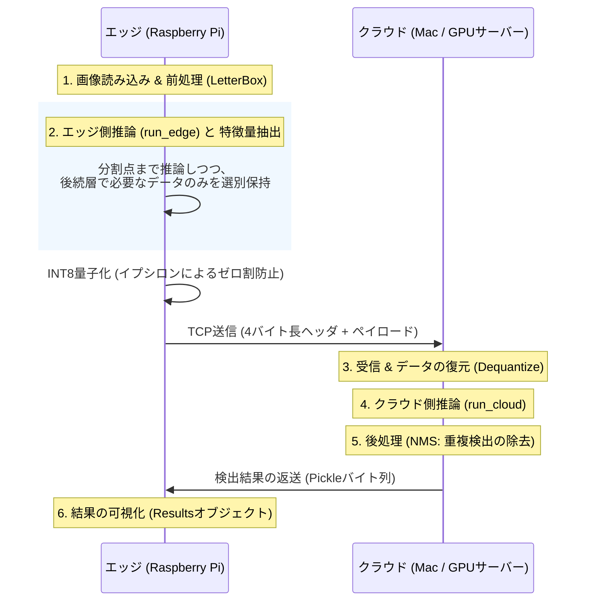
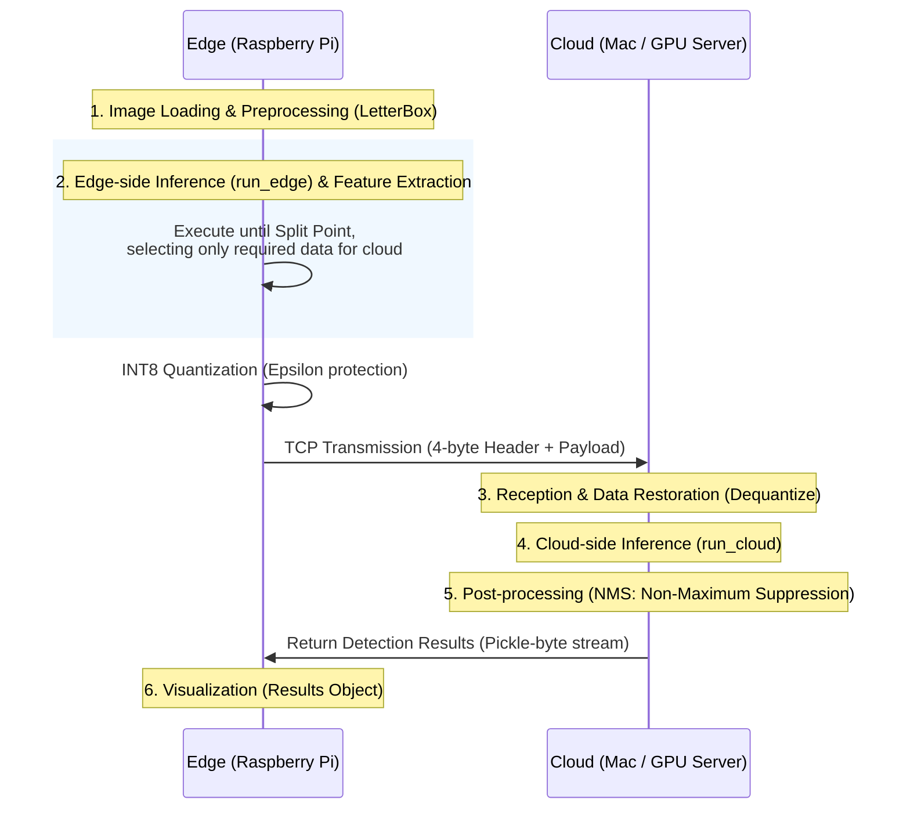

# Edge-Cloud Collaborative Split Inference Optimization for YOLOv8

## プロジェクト概要 (Project Overview)
本プロジェクトは、エッジデバイス（Raspberry Pi等）とクラウド間（またはクラウドサーバー）でYOLOv8の推論処理を分割実行し、システム全体の遅延と通信コストを最適化する「分割推論フレームワーク」の構築を目的とする。
リソース制約の厳しいエッジ環境とクラウドの計算資源を最適に協調させる分散システムの実現を目指す。
単にモデルを分けるだけでなく、**Skip Connection（層を飛び越えた接続）を考慮したメモリ管理**と**数値安定性を備えた量子化**を統合している点が技術的特徴である。

## 背景と課題 (Background & Challenges)
IoTデバイスの普及に伴い、エッジ側での高度なAI推論が求められているが、単一のエッジデバイスでは計算資源が不足し、クラウドへの全データ転送は通信遅延や帯域幅の圧迫を招く。
本研究では、ニューラルネットワークの推論処理を特定の層で分割し、前半をエッジ、後半をクラウドで実行する「分割推論（Split Inference）」を採用する。
最大の課題は、ネットワーク状態や各ノードの計算能力に依存して変動する「通信時間」と「計算時間」の合計を最小化する**最適な分割点（Split Point）の特定**である。

## 手法とアプローチ (Methodology)

本フレームワークでは、以下の2つの柱に基づきエッジ・クラウド協調推論を最適化しています。

1. **実測ベースのプロファイリングと最適化**
    *   **実機プロファイリング**: シミュレーションに頼らず、実機間での計算時間・通信時間を層ごとにプロファイリングし、実測値に基づいて分割点を決定します。
    *   **Docker環境を用いた分割推論**: 分割点決定後は、エッジ、クラウドともに同じDocker環境を用いて分割推論を実行します。
2. **計算・通信効率の最大化**
    *   **勾配情報の除去**: 推論に不要な勾配情報を除去し、計算およびメモリのオーバーヘッドを最小化しています。
    *   **テンソル選別ロジック**: `last_use`（各テンソルの最終使用層）を解析するアルゴリズムを実装。後続層で不要なデータを即座に破棄し、スキップ接続（Skip Connection）に必要なデータのみを最小限の `context` (中間特徴量)として抽出することで、メモリ保持量と転送量を同時に削減します。
    *   **INT8量子化の実装**: 推論精度を維持しつつテンソルを圧縮する「INT8量子化・復元処理」をパイプラインに統合。通信帯域の消費を大幅に抑制します。

## 従来研究との差異 (Difference from Prior Work)

分割推論の代表的研究として、Huaweiの **Auto-Split** が挙げられる。
Auto-Splitでは、ResNetやYOLOv3などを対象として、エッジ計算時間・通信時間・クラウド計算時間を事前プロファイリングし、それらの総和が最小となる分割点（Split Point）を選択するアプローチが採用されている。

しかし、従来研究で主に対象とされてきたResNet系やYOLOv3は、比較的**直線的（Sequential）なネットワーク構造**を前提としている。

一方、YOLOv8は以下の特徴を持つ。

* **Skip Connection（スキップ接続）**
* **FPN / PAN による特徴融合**
* **Concatを伴う有向グラフ（DAG: Directed Acyclic Graph）構造**

※FPN/PANは、画像の細かい形状情報と物体全体の意味情報を複数の層で結合し、小さい物体から大きい物体まで高精度に検出するための仕組みである。その結果、YOLOv8は単純な一直線構造ではなく、複数の特徴量が再利用される有向グラフ（DAG）構造を持つ。

このため、単純に「ある層で分割して中間出力を送る」だけでは正しく推論を継続できない。

例えば、クラウド側のConcat層では、分割点以前に生成された複数の中間特徴量が再利用される。そのため、YOLOv8の分割推論では、後続層で再利用される特徴量を追跡・保持する**依存関係管理（Dependency Management）**が不可欠となる。

本研究では、この問題に対して：

* 各層の入力元 (`m.f`)
* テンソルの最終使用位置 (`last_use`)
* 必要中間特徴量のみを抽出する `context` 管理

を実装し、YOLOv8のDAG構造を考慮した分割推論を実現している。

さらに、従来研究では通信時間を理論帯域（Bandwidth）から推定する手法も多いのに対し、本研究では：

* 実機間ソケット通信
* 量子化
* Serialization / Deserialization
* Tensor復元

まで含めた**実測ベースの通信時間評価**を採用している。

したがって本研究は、従来の「直線型ネットワークを対象とした分割推論」から一歩進み、**YOLOv8の複雑な特徴融合構造と実通信オーバーヘッドを考慮した、実運用志向のEdge–Cloud分割推論フレームワーク**として位置づけられる。

---

## システムアーキテクチャ (System Architecture & Flow)

### 🛠 推論パイプラインの詳細

1.  **[エッジ] 前処理 (Step 1)**: 入力画像を読み込み、`letterbox` 等を用いてYOLO入力サイズへの整形とテンソル化を行います。
2.  **[エッジ] 推論実行と特徴量抽出 (Step 2)**: `run_edge` を実行。指定した `split_point` まで推論を進めながら、`needed` 集合（後続層で参照されるインデックス群）に基づき、クラウド側での再開に必要な中間特徴量（`context`）のみを選別して保持します。不要なデータは `last_use` 判定により即座に破棄されます。
3.  **[エッジ] 量子化・シリアライズ**: 出力テンソルおよび選別した中間特徴量をINT8（整数）に量子化します。数値的安定性を保つためイプシロン保護（ゼロ割防止）を適用し、メタデータを含むバイナリデータを生成します。
4.  **[通信] TCP送信**: 独自プロトコル（4バイト長ヘッダによるデータサイズ指定 ＋ ペイロード）を用いて、パケットをクラウドへ送信します。
5.  **[クラウド] 受信・復元・推論継続 (Step 3 & 4)**: 受信バイナリから量子化係数を用いてテンソルを復元し、`run_cloud` を呼び出して計算グラフの残りの層を完遂させます。
6.  **[クラウド] 後処理 (Step 5)**: 推論出力に対し NMS (Non-Maximum Suppression) を適用して重複する検出枠を除去し、`scale_boxes` で座標を元画像サイズへ復元します。
7.  **[エッジ] 結果の可視化 (Step 6)**: 返送された検出結果を元画像に描画。`ultralytics.engine.results.Results` オブジェクトを介し、公式ライブラリ準拠の柔軟な可視化を行います。

## 用語と主要概念 (Key Concepts)
本システムのコードを理解するための主要な概念を以下にまとめます。

### 1. 分割推論のデータ制御
*   **`run_edge` / `run_cloud`**: 
    *   モデルを前後半に分け、エッジ側とクラウド側でそれぞれ担当範囲を実行する関数。
*   **`split_point`**: 
    *   「どこでネットワークを断つか」を示す層の番号（インデックス）。
*   **`edge_out` と `context`**:
    *   **`edge_out`**: 分割した層の「直接の出力」。
    *   **`context`**: YOLOv8特有の「過去の層のデータを後で再利用する（Skip Connection）」ための控えデータ。**これがないとクラウド側で推論を再開できません。**
*   **`needed` 集合**: 
    *   「クラウド側が後で必要とするレイヤー番号」をあらかじめ集めたもの。これに基づき、送るべきデータのみを最小限に絞り込みます。
*   **`last_use` (最終使用レイヤー判定)**:
    *   各データが「最後にどの層で使われるか」を記録した辞書。この値を参照し、**「もう使わないデータは即座にメモリから破棄し、クラウドへも送らない」**という厳密なメモリ最適化を行っています。

### 2. エンジニアリングの工夫
*   **LetterBoxを用いた前処理**: 
    *   画像のアスペクト比（縦横比）を維持したまま640×640へリサイズし、不足領域をパディングすることで物体の歪みを防ぎ、YOLOv8のstride構造と整合した入力を生成する。さらに、scale・pad情報を保持して検出座標を元画像へ正確に復元し、np.ascontiguousarray によりテンソル変換とメモリ転送を高速化している。
*   **イプシロン(ε)によるゼロ割防止**: 
    *   データをINT8（256段階の整数）に圧縮（量子化）する際、最大値が0だと計算エラーが発生します。極小値（イプシロン）を足すことで、**どんな入力に対してもシステムをクラッシュさせない堅牢性**を確保しています。
*   **カスタムプロトコル (4バイト長ヘッダ)**: 
    *   TCP通信は「データの切れ目」が保証されません。データの先頭に「今から何バイト送るか」という4バイトの情報を付与することで、**ストリーミング環境でも確実にデータを受信できる信頼性**を実装しています。
*   **NMS (Non-Maximum Suppression)**: 
    *   AIは1つの物体に対して複数の「検出枠」を出してしまうことが多いため、最も確率の高い1つに絞り込む数学的な後処理です。
*   **`ultralytics.engine.results.Results`**: 
    *   YOLOv8公式ライブラリが提供する標準的な出力形式。これを利用することで、検出結果の描画や保存を柔軟に行えます。

## 現在の進捗と計測結果 (Current Status & Results)

### 1. プロトタイプ環境
*   **エッジ**: Raspberry Pi 4 (Docker環境)
*   **クラウド**: MacBook Pro (Docker環境)
*   **モデル**: YOLOv8n

### 2. 単体推論時間 (Baseline)
*   **Raspberry Pi 単体**: 357 ms
*   **MacBook 単体**: 131 ms

### 3. 分割推論の実行結果 (Experimental Results)
yolov8n（全22レイヤー）において、**Split Layer = 3** を選択した際の計測データは以下の通りです。

| 項目 | 計測値 | 備考 |
| :--- | :--- | :--- |
| **トータル処理時間** | **762.8 ms** | 前処理〜推論〜返送まで |
| **前処理 (Preprocessing)** | **284.6 ms** | リサイズ等。**最大のボトルネック** |
| **エッジ側計算時間 (Edge)** | 176.7 ms | レイヤー 0～3 |
| **圧縮処理 (Compression)** | 4.8 ms | INT8量子化&シリアライズ。非常に軽量 |
| **通信 (Communication)** | 191.1 ms | TCP転送 |
| **クラウド側計算時間 (Cloud)** | 203.9 ms | レイヤー 4～21 |
| **可視化処理(Visualization)** | 567.9ms | 描画処理。トータル処理時間には含めない |
| **通信データサイズ** | 402.44 KB | |

### 4. 分析と考察
*   **ボトルネックの特定**: 前処理（約280ms）が全体の約37%を占めており、ここが最大の最適化ポイントであることが判明しました。
*   **分割点の傾向**: Split Layer = 3〜4 付近が現在の環境では最も高速ですが、通信・Dockerのオーバーヘッドにより、現状はラズパイ単体での実行（357ms）を上回る遅延が発生しています。
*   **量子化の効果**: 圧縮処理自体は5ms以下と非常に高速であり、量子化による精度維持と通信量削減の両立が、実用化に向けた鍵となります。

**[分割推論の出力結果]**

---

## 今後のマイルストーン (Future Milestones)

### Phase 1: 自動プロファイリングと最適化

* [ ] エッジ・クラウドにおける各層ごとの計算時間および通信時間を自動計測し、最適な split layer を探索するプロファイリング基盤の構築。
* [ ] 高性能 GPU 搭載クラウドサーバーへの移行と、複数エッジデバイスからの推論要求を継続的に受け付ける Edge–Cloud 推論サーバー基盤の構築。
* [ ] 前処理・推論実行・量子化/圧縮・通信処理を含むエンドツーエンド推論パイプラインの最適化。

### Phase 2: 動的環境への適応とスケーリング
* [ ] 研究室サーバー、大学スパコン、パブリッククラウド等、多様なノード環境への展開。
* [ ] 単一の静止画から、動画ストリーム（連続画像フレーム）を対象とした分割推論パイプラインの構築。
* [ ] 複数台のエッジデバイスが混在する環境や、動的に変動するネットワーク帯域下において、適切な分割点を自律的に模索・決定するアルゴリズムの実装。

### Phase 3: アプリケーション開発と社会実装 (Vision)
* [ ] **分散型AI監視システムの構築**: 小型エッジカメラから取得した映像を基に、人物認識や入退室管理をエッジ・クラウド協調でリアルタイムに実行。
* [ ] **自動省エネ管理システムへの統合**: 室内人数を継続的にトラッキングし、在室者ゼロを検知した際に空調や照明の消し忘れを判定。SlackやLINE APIと連携した自動通知・制御システムを実装し、スマートなエネルギー管理に貢献する。

---

# Edge-Cloud Collaborative Split Inference Optimization for YOLOv8

## Project Overview
This project aims to build a **Split Inference Framework** for YOLOv8 that distributes the inference workload between edge devices (e.g., Raspberry Pi) and cloud servers. The goal is to optimize end-to-end latency and communication costs by effectively coordinating resource-constrained edge environments with high-performance cloud computing.

Beyond simply splitting the model, this framework features **advanced memory management for Skip Connections** and **numerically stable quantization** to ensure robustness in real-world deployments.

## Background & Challenges
As AIoT devices proliferate, the demand for sophisticated on-device AI inference is rising. However, standalone edge devices often lack sufficient computational power, while offloading entire raw data streams to the cloud leads to high latency and bandwidth congestion.

This research adopts **Split Inference**, where a neural network is divided at a specific layer: the early layers run on the edge, and the remaining layers are processed in the cloud. The primary challenge is the **dynamic identification of the optimal Split Point** to minimize the total cost (Computation Time + Communication Time) under fluctuating network conditions.

## Methodology
The framework optimizes edge-cloud collaborative inference through two core pillars:

1. **Measurement-Based Profiling and Optimization**
    *   **Real-Device Profiling**: Eschewing simulations, the system profiles per-layer computation and communication times on actual hardware to dynamically determine the split point based on real-world metrics.
    *   **Consistent Docker Environments**: Both edge and cloud nodes utilize identical Docker-based environments to ensure seamless execution and portability.

2. **Maximizing Computational and Communication Efficiency**
    *   **Gradient Stripping**: Removes unnecessary gradient information for inference to minimize computational and memory overhead.
    *   **Tensor Selection Logic**: Implements a `last_use` analysis algorithm (tracking the final usage layer for each tensor). It immediately discards data no longer needed in subsequent layers and extracts only the minimal required **`context` (intermediate features)** for skip connections, reducing both memory footprint and transmission size.
    *   **INT8 Quantization**: Integrates an "INT8 Quantization/Restoration" pipeline to compress tensors while maintaining accuracy, significantly suppressing bandwidth consumption.

## Difference from Prior Work

A representative study in split inference is Huawei's **Auto-Split** framework.
Auto-Split targets models such as ResNet and YOLOv3, where edge computation time, communication latency, and cloud computation time are profiled in advance, and the split point is selected to minimize their total execution cost.

However, models primarily considered in prior work, including ResNet-based architectures and YOLOv3, generally assume relatively **sequential network structures**.

In contrast, YOLOv8 introduces the following characteristics:

* **Skip Connections**
* **Feature fusion through FPN / PAN**
* **Directed Acyclic Graph (DAG) structures involving Concat operations**

*FPN/PAN are feature fusion mechanisms that combine fine-grained spatial information with high-level semantic information across multiple layers, enabling accurate detection of both small and large objects. As a result, YOLOv8 does not follow a simple linear architecture but instead forms a DAG structure in which intermediate features are repeatedly reused.*

Because of this structure, split inference cannot be performed simply by splitting the model at an arbitrary layer and transmitting a single intermediate output.

For example, Concat layers executed on the cloud side may require multiple intermediate features generated before the split point. Therefore, YOLOv8 split inference requires explicit **dependency management** to track and preserve features reused by subsequent layers.

To address this challenge, this work implements:

* Layer input-source tracing (`m.f`)
* Final tensor usage analysis (`last_use`)
* `context` management for transmitting only required intermediate features

These mechanisms enable split inference while preserving the DAG dependency structure of YOLOv8.

Furthermore, while many previous studies estimate communication latency from theoretical bandwidth models, this work adopts an **empirical communication-time evaluation** that includes:

* Real socket communication between devices
* Quantization
* Serialization / Deserialization
* Tensor reconstruction overhead

Therefore, this work extends beyond conventional split inference designed for linear network architectures and positions itself as a **practical Edge–Cloud split inference framework that explicitly considers YOLOv8's complex feature-fusion structure and real communication overheads**.

---

## System Architecture & Flow

### 🛠 Inference Pipeline Details

1.  **[Edge] Preprocessing (Step 1)**: Loads the input image and applies `letterbox` to resize it to the YOLO input size (640x640) while maintaining the aspect ratio, followed by tensorization.
2.  **[Edge] Inference & Feature Extraction (Step 2)**: Executes `run_edge` up to the `split_point`. Based on the `needed` set (indices referenced by future layers), it selects and retains intermediate features (**`context`**) required for cloud-side resumption. Obsolete data is discarded immediately via `last_use` tracking.
3.  **[Edge] Quantization & Serialization**: Quantizes the edge output and context tensors to INT8 (integers). It applies **Epsilon protection** (division-by-zero prevention) for numerical stability and generates a binary payload with metadata.
4.  **[Communication] TCP Transmission**: Transmits the packet via a custom protocol (4-byte length header + payload) over a TCP socket.
5.  **[Cloud] Reception, Restoration & Resumption (Step 3 & 4)**: Recovers the tensors from the binary stream using quantization scales and invokes `run_cloud` to complete the computation graph.
6.  **[Cloud] Post-processing (Step 5)**: Applies NMS (Non-Maximum Suppression) to filter overlapping detection boxes and rescales coordinates back to the original image size using `scale_boxes`.
7.  **[Edge] Result Visualization (Step 6)**: Receives and renders the detection results on the original image using the `ultralytics.engine.results.Results` object for flexible visualization.

## Key Concepts

### 1. Split Inference Data Control
*   **`run_edge` / `run_cloud`**: Functions that execute the early and later segments of the model respectively.
*   **`split_point`**: The index indicating where the network computation is severed.
*   **`edge_out` vs. `context`**:
    *   **`edge_out`**: The direct output of the layer at the split point.
    *   **`context`**: Cached data from previous layers required for Skip Connections. **Inference cannot resume in the cloud without this data.**
*   **`needed` set**: Pre-calculated indices of layers required by the cloud side, used to prune non-essential data.
*   **`last_use` (Final Usage Detection)**: A dictionary tracking the last layer to reference each tensor. This enables strict memory optimization by discarding data as soon as it is no longer required.

### 2. Engineering Insights
*   **LetterBox Preprocessing**: Maintains aspect ratio and pads to 640x640 to prevent object distortion. It ensures compatibility with YOLOv8 stride structures and utilizes `np.ascontiguousarray` for faster tensor conversion.
*   **Epsilon (ε) Protection**: During INT8 quantization, a tiny value (epsilon) is added to the divisor to prevent system crashes if the maximum value in a tensor is zero, ensuring **production-level robustness**.
*   **Custom Protocol (4-byte Header)**: TCP does not guarantee message boundaries. By prefixing each message with its length, the system ensures **reliable data reconstruction** in streaming environments.
*   **NMS (Non-Maximum Suppression)**: A mathematical post-process that consolidates multiple overlapping detection boxes into a single, high-confidence prediction.

## Current Status & Results

### 1. Prototype Environment
*   **Edge Node**: Raspberry Pi 4 (Docker)
*   **Cloud Node**: MacBook Pro (Docker)
*   **Model**: YOLOv8n

### 2. Standalone Latency (Baseline)
*   **Raspberry Pi (Standalone)**: 357 ms
*   **MacBook Pro (Standalone)**: 131 ms

### 3. Split Inference Benchmark (Experimental Results)
Measured data for YOLOv8n (22 layers) with **Split Layer = 3**:

| Item | Value | Notes |
| :--- | :--- | :--- |
| **Total Latency** | **762.8 ms** | E2E (Preprocess → Inference → Return) |
| **Preprocessing** | **284.6 ms** | Resizing, etc. **The primary bottleneck.** |
| **Edge Compute** | 176.7 ms | Layers 0–3 |
| **Compression** | 4.8 ms | INT8 Quantization & Serialization. Extremely lightweight. |
| **Communication** | 191.1 ms | TCP Transfer & Header Overhead |
| **Cloud Compute** | 203.9 ms | Layers 4–21 |
| **Visualization** | 567.9 ms | Rendering. (Excluded from Total Latency) |
| **Payload Size** | 402.44 KB | |

### 4. Analysis & Observations
*   **Bottleneck Identification**: Preprocessing accounts for ~37% of the total latency (284.6 ms), identifying it as the highest-priority target for future optimization.
*   **Split Point Trends**: While Split Layer 3–4 is currently the most efficient configuration, the overhead from Docker and TCP networking currently causes higher latency than standalone Raspberry Pi execution.
*   **Quantization Efficiency**: Compression takes less than 5 ms, proving that INT8 quantization is a viable strategy for balancing accuracy and communication volume.

**[Split Inference Output Result]**

---

## Future Milestones

### Phase 1: Automated Profiling & Optimization
* [ ] Build a profiling engine to automatically measure per-layer compute/comm times and find the mathematical optimal split point.
* [ ] Migrate to high-performance GPU cloud servers and establish an Edge-Cloud inference server capable of handling continuous requests from multiple edge nodes.
* [ ] Optimize the end-to-end pipeline (Preprocessing → Quantization → Comm).

### Phase 2: Dynamic Adaptation & Scaling
* [ ] Deploy to diverse environments (Lab servers, HPC clusters, and Public Cloud).
* [ ] Develop a split inference pipeline for continuous video streams rather than static images.
* [ ] Implement an autonomous algorithm to adapt the split point in real-time based on fluctuating network bandwidth and device load.

### Phase 3: Application & Social Implementation (Vision)
*   **Distributed AI Surveillance**: Real-time person recognition and access management using small edge cameras coordinated with the cloud.
*   **Autonomous Energy Management**: Continuous occupancy tracking to detect empty rooms and automatically manage HVAC/lighting via Slack/Line API integration, contributing to smart city sustainability.
