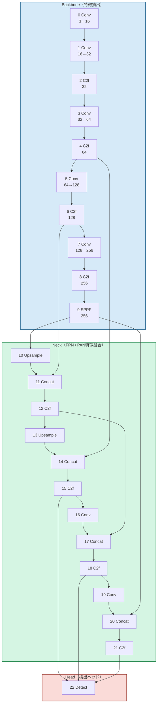
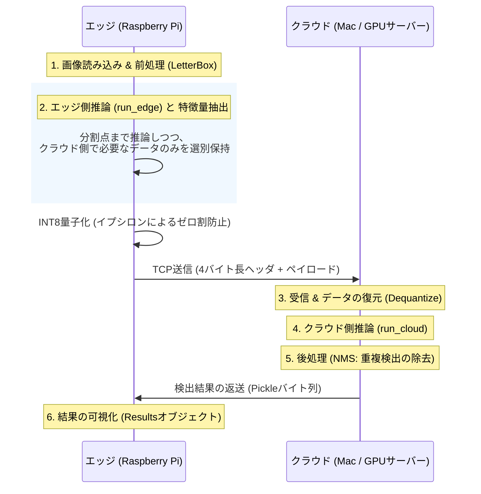
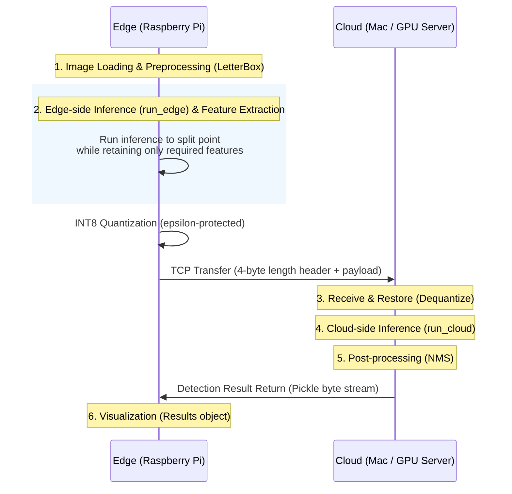

# Edge-Cloud Collaborative Split Inference Optimization for YOLOv8
(English version is available below.)
## プロジェクト概要 (Project Overview)
本プロジェクトは、エッジデバイス（Raspberry Pi等）とクラウド間（またはクラウドサーバー）でYOLOv8の推論処理を分割実行し、システム全体の遅延と通信コストを最適化する「分割推論フレームワーク」の構築を目的とする。
リソース制約の厳しいエッジ環境とクラウドの計算資源を最適に協調させる分散システムの実現を目指す。
単にモデルを分けるだけでなく、**Skip Connection（層を飛び越えた接続）を考慮したメモリ管理**と**数値安定性を備えた量子化**を統合している点が技術的特徴である。

## ディレクトリ構成

分割推論の実行・モデル・入力・実験結果を分離している。詳細な実行方法は
[`auto_split/README.md`](auto_split/README.md) を参照する。

```text
auto_split/
├── src/          # edge.py, cloud.py, split_model.py
├── models/       # 学習済み重み
├── samples/      # 再現実験用の入力
├── benchmarks/   # 単体・層別の性能測定
├── tools/        # 分割点探索・ONNX・構造解析
└── outputs/      # 実行結果（Git管理外）
```

## 背景と課題 (Background & Challenges)
IoTデバイスの普及に伴い、エッジ側での高度なAI推論が求められているが、単一のエッジデバイスでは計算資源が不足し、クラウドへの全データ転送は通信遅延や帯域幅の圧迫を招く。
本研究では、ニューラルネットワークの推論処理を特定の層で分割し、前半(分割レイヤーまで)をエッジ、後半をクラウドで実行する「分割推論（Split Inference）」を採用する。
最大の課題は、ネットワーク状態や各ノードの計算能力に依存して変動する「通信時間」と「計算時間」の合計を最小化する**最適な分割点（Split Point）の特定**である。

## 手法とアプローチ (Methodology)

本フレームワークでは、以下の2つの柱に基づきエッジ・クラウド協調推論を最適化しています。

1. **実測ベースのプロファイリングと最適化**
    * **実機プロファイリング**: シミュレーションに頼らず、実機間での計算時間・通信時間を分割点ごとに実測し、全体のレイテンシが最小となる分割点を決定。
    * **Docker環境を用いた分割推論**: 分割点決定後は、エッジ、クラウドともに同じDocker環境を用いて分割推論を実行。
2. **計算・通信効率の最大化**
    * **推論モード (`torch.inference_mode()`) の利用**: 勾配計算を無効化し、推論時の計算負荷とメモリ消費を削減する。
    * **中間特徴量の選別・保持**: YOLOv8のSkip Connectionを考慮し、クラウド側で必要となるエッジ側の中間特徴量のみを保持・転送する。
    * **INT8量子化の実装**: 出力テンソルおよび中間特徴量をINT8へ圧縮・復元することで、通信データ量を大幅に削減している。

## 現在の進捗と計測結果 (Current Status & Results)

### 1. プロトタイプ環境

* **エッジ**: Raspberry Pi 5 (16GB SDRAM, Docker環境)
* **クラウド**: MacBook Pro (8GB SDRAM, Docker環境)
* **モデル**: YOLOv8n
* **入力画像**: 4032 × 3024 JPEG (約4.4 MB)

---

### 2. 単体推論時間 (Baseline)

#### Raspberry Pi 5 (Docker)

| 項目 | 計測値 |
| :--- | :--- |
| Model Loading | 55.5 ms |
| Preprocessing | 285.6 ms |
| YOLOv8 Inference | 603.1 ms |
| Total (Except Model Loading) | 891.9 ms |

別途ベンチマークスクリプトによる30回平均：

| 項目 | 計測値 |
| :--- | :--- |
| Average Latency | 775.5 ms |
| FPS | 1.29 |
| Min Latency | 742.6 ms |
| Max Latency | 825.6 ms |

#### MacBook Pro (Docker)

| 実行回数 | 前処理 | 推論 | 合計 |
| :--- | :--- | :--- | :--- |
| 1回目 | 964.7 ms | 461.1 ms | 1427.8 ms |
| 2回目 | 205.1 ms | 233.5 ms | 439.7 ms |
| 3回目 | 230.6 ms | 261.7 ms | 493.2 ms |

初回実行時には大きなウォームアップオーバーヘッドが観測された。

---

### 3. 分割推論の実行結果 (Split Layer = 3)

YOLOv8n（Ultralytics内部モジュール22層）において、Split Layer = 3 を選択した場合の計測結果を示す。

| 項目 | 1回目 | 2回目 | 3回目 | 4回目 | 5回目 |
| :--- | ---: | ---: | ---: | ---: | ---: |
| Preprocessing | 285.8 ms | 286.2 ms | 286.3 ms | 285.9 ms | 286.2 ms |
| Edge | 177.1 ms | 177.9 ms | 176.6 ms | 179.1 ms | 176.4 ms |
| Compression | 5.2 ms | 4.9 ms | 5.1 ms | 5.1 ms | 4.9 ms |
| Communication | 215.9 ms | 97.4 ms | 69.9 ms | 61.8 ms | 65.9 ms |
| Cloud | 545.2 ms | 322.7 ms | 215.2 ms | 284.5 ms | 179.7 ms |
| Total | 1229.2 ms | 889.1 ms | 753.1 ms | 816.5 ms | 713.0 ms |

通信データサイズ：

| 項目 | 値 |
| :--- | ---: |
| Communication Size | 402.42 KB |

Split Layer = 3 の場合、クラウド側で必要となる追加の中間特徴量は存在しないため、

```python
context_indices = []
```

となり、分割層出力 (`edge_out`) のみを送信して推論を継続できる。

---

### 4. クラウド側処理のウォームアップ特性

クラウド側推論時間および通信時間は初回実行時に大きく増加し、その後安定化する傾向が確認された。

| 実行回数 | Communication | Cloud |
| :--- | ---: | ---: |
| 1回目 | 215.9 ms | 545.2 ms |
| 2回目 | 97.4 ms | 322.7 ms |
| 3回目 | 69.9 ms | 215.2 ms |
| 4回目 | 61.8 ms | 284.5 ms |
| 5回目 | 65.9 ms | 179.7 ms |

初回実行では TCP 接続確立、PyTorch 内部キャッシュ、メモリ確保、およびライブラリ初期化の影響により大きなオーバーヘッドが観測された。

ウォームアップ後（2〜5回目）の平均値：

| 項目 | 平均 |
| :--- | ---: |
| Communication | 73.8 ms |
| Cloud | 250.5 ms |
| Total | 792.9 ms |

---

### 5. 前処理時間の内訳

入力画像：

* Resolution: 4032 × 3024
* Size: 約4.4 MB

4回目実行時の詳細プロファイリング結果を示す。

| 処理 | 時間 |
| :--- | ---: |
| `cv2.imread()` | 273.7 ms |
| LetterBox Resize | 5.4 ms |
| RGB変換 + Transpose | 0.7 ms |
| Tensor変換 | 5.9 ms |
| Device Transfer | 0.1 ms |

これらの値は複数回実行してもほぼ変動しなかった。

前処理全体（約286 ms）のうち約96%が JPEG デコード (`cv2.imread`) に費やされていることが確認された。

---

### 6. 分析と考察

* **最大のボトルネックは推論ではなく画像読込である。**
  * 前処理時間（約286ms）のうち約274msが `cv2.imread()` による JPEG デコードで占められていた。
  * LetterBox や Tensor変換のコストは極めて小さい。

* **分割推論による計算量削減は確認できた。**
  * Raspberry Pi 単体推論では約603msを要するのに対し、Split Layer = 3 では Edge + Cloud 推論時間は約427ms（177ms + 250ms）まで削減された。

* **通信オーバーヘッドが依然として支配的である。**
  * 通信時間は平均約74msであり、推論高速化効果の一部を相殺している。

* **クラウド側には顕著なウォームアップが存在する。**
  * 初回実行では Cloud Time が 545ms に達したが、ウォームアップ後は約180〜320msで推移した。

* **量子化のオーバーヘッドは極めて小さい。**
  * INT8量子化およびシリアライズ処理は約5msであり、通信量削減に対して十分小さいコストで実現できている。

* **Split Layer = 3 では追加特徴量転送が不要である。**
  * `context_indices=[]` であり、分割層出力のみを送信して推論を再開できた。
  * 一方で、より深い分割点では Skip Connection や Concat により中間特徴量の転送が必要となる。

* **今後の最適化対象**
  * カメラストリーム入力による JPEG デコード削減
  * GPU搭載クラウドサーバーへの移行
  * 動的Split Point選択アルゴリズムの実装
  * 動画ストリーム向けSplit Inferenceへの拡張

**[分割推論の出力結果]**


## 従来研究との差異 (Difference from Prior Work)

分割推論の代表的研究として、Huaweiの **Auto-Split** が挙げられる。  
Auto-Splitは、ResNetやYOLOv3を対象に、エッジ計算・通信・クラウド計算を事前プロファイリングし、総遅延が最小となる分割点（Split Point）を選択する手法である。

しかし、従来研究で主に扱われるResNet系やYOLOv3は、比較的**直線的（Sequential）なネットワーク構造**を前提としている。

一方、YOLOv8は：

* **Skip Connection**
* **FPN / PAN による特徴融合**
* **Concatを伴う有向グラフ（DAG）構造**

を持つ。  
FPN/PANは、画像の細部情報と物体全体の意味情報を複数層で融合し、小物体から大物体まで高精度に検出する仕組みである。その結果、YOLOv8では過去の特徴量が後続層(クラウド側)で再利用されるため、単純に「分割層の出力だけ」を送信しても推論を継続できない。

本研究では、この問題に対し：

* クラウド側で再利用される特徴量のレイヤー番号を事前解析した集合(`needed`)
* テンソル最終使用位置 (`last_use`)
* 必要特徴量のみを保持する `context` 管理

を実装し、**YOLOv8のDAG構造に対応した分割推論**を実現している。

さらに、従来研究が理論帯域（Bandwidth）による通信推定を採用することが多いのに対し、本研究では：

* 実機ソケット通信
* INT8量子化
* Serialization / Deserialization
* Tensor復元

まで含めた**実測ベースの通信時間評価**を行っている。

したがって本研究は、従来の「直線型ネットワーク向け分割推論」を発展させ、**YOLOv8の複雑な特徴融合構造と実通信オーバーヘッドを考慮した、実運用志向のEdge–Cloud分割推論フレームワーク**として位置づけられる。

## YOLOv8nのモデル構造 (YOLOv8n Model Architecture)

YOLOv8n は大きく以下の3つの構成要素から成る。

* **Backbone** – 入力画像から階層的な特徴量を抽出する部分
* **Neck** – FPN/PAN により複数スケールの特徴量を融合し、小物体・大物体双方の検出性能を向上させる部分
* **Head** – 複数スケールの特徴量を用いて最終的な物体検出を行う部分

YOLOv8 は ResNet のような単純な直線型（Sequential）CNNではなく、**Skip Connection** と **Concat による特徴融合** を含む **DAG（Directed Acyclic Graph: 有向非巡回グラフ）構造** を採用している。

この構造は検出精度向上に有効である一方、**分割推論（Split Inference）** においては「過去の特徴量が後段で再利用される」という課題を生む。

### YOLOv8n レイヤー構造 (Ultralytics内部モジュール)


※ モジュール内の数字は **レイヤー番号** と **チャネル数（Channels）** を表す。  
`A→B` は **入力チャネル数 A、出力チャネル数 B** を意味する。

### 構造の概要

| 構成要素 | 主なモジュール | 役割 |
|---|---|---|
| **Backbone** | Conv, C2f, SPPF | 低レベルから高レベルまでの画像特徴量を抽出 |
| **Neck** | Upsample, Concat, C2f | FPN/PAN によるマルチスケール特徴融合 |
| **Head** | Detect | Bounding Box とクラスの最終予測 |

### 主要モジュールの説明 (Module Descriptions)

| モジュール | 説明 |
|---|---|
| **Conv** | 畳み込みによる特徴抽出とチャネル変換を行う基本層。 |
| **C2f** | Skip Connection を含む YOLOv8 の特徴抽出ブロック。 |
| **SPPF** | 広域コンテキストを効率的に取得するプーリング層。 |
| **Upsample** | 特徴マップの解像度を拡大する処理。 |
| **Concat** | 複数特徴量をチャネル方向に結合する演算。 |
| **Detect** | Bounding Box とクラスを出力する検出ヘッド。 |

### YOLOv8nにおける分割推論の難しさ

YOLOv8 は **完全な直線型モデルではない**。Skip Connection と Concat により、Backbone や Neck の途中で生成された特徴量（例: Layer 4, 6, 9）が後段の層で再利用される。
そのため、分割推論では **「分割層の出力だけ」を送れば良いわけではない**。

例えば：
* **Layer11 ← Layer6**
* **Layer14 ← Layer4**
* **Layer17 ← Layer12**
* **Layer20 ← Layer9**
のような依存関係が存在する。

したがってクラウド側で推論を正しく再開するには、分割層出力 (`edge_out`) に加え、依存解析によって特定された中間特徴量 (`context`) を適切に保持・転送する必要がある。
本研究で実装した `needed`・`last_use`・`context` 管理は、この **YOLOv8のDAG構造に対応したSplit Inference** を実現するための中核技術である(詳細は後述)。

---

## システムアーキテクチャ (System Architecture & Flow)


※Pickleは研究・ローカル環境用途を想定しており、信頼できない送信元に対しては安全ではない。

### 🛠 推論パイプラインの詳細
1. **[エッジ] 前処理 (Step 1)**: 入力画像を読み込み、`letterbox` を用いてYOLO入力サイズへの整形とテンソル化を行う。
2. **[エッジ] 推論実行と特徴量抽出 (Step 2)**: `run_edge` を実行し、`split_point` まで推論を進める。`needed` 集合（クラウド側で再利用されるレイヤー番号）に基づき、推論再開に必要な中間特徴量（`context`）のみを保持する。また、`last_use` によりエッジ内部で不要になった特徴量を即時解放し、メモリ使用量を削減する。
3. **[エッジ] 量子化・シリアライズ**: `edge_out` および `context` を INT8 に量子化する。ゼロ割防止のためイプシロン保護を適用し、メタデータを含むバイナリ形式へ変換する。
4. **[通信] 4バイト長ヘッダによるTCP通信**: TCPはメッセージ境界を保証しないため、先頭4バイトにデータ長を付与し、受信側で必要サイズを正確に取得している。
5. **[クラウド] 受信・復元・推論継続 (Step 3 & 4)**: 受信データを復元し、`run_cloud` により残りの計算グラフを実行する。
6. **[クラウド] 後処理 (Step 5)**: NMS（Non-Maximum Suppression）で重複検出を除去し、`scale_boxes` を用いて検出結果の座標を元画像サイズへ復元する。
7. **[エッジ] 結果の可視化 (Step 6)**: 返送された検出結果を元画像へ描画し、`ultralytics.engine.results.Results` オブジェクトを介して可視化する。

## 用語と主要概念 (Key Concepts)
本システムのコードを理解するための主要概念を以下にまとめる。
### 1. 分割推論のデータ制御
* **`run_edge` / `run_cloud`**  
  モデルを前後半に分割し、エッジ側・クラウド側でそれぞれ担当範囲を実行する関数。
* **`split_point`**  
  ネットワークを分割する層番号（インデックス）。
* **`edge_out` と `context`**  
  * **`edge_out`**: 分割層の直接出力テンソル。  
  * **`context`**: Skip Connection や Concat のためにクラウド側で再利用される中間特徴量。これがないと YOLOv8 の推論は正しく再開できない。
* **`needed` 集合**  
  クラウド側計算で必要となるレイヤー番号の集合。これを用いて送信すべき中間特徴量のみを選別する。
* **`last_use` (最終使用レイヤー判定)**  
  各特徴量がエッジ側で最後に利用される層を記録した辞書。推論中に不要となったテンソルを即時解放し、エッジ側メモリ使用量を削減する。

### 2. エンジニアリングの工夫
*   **LetterBoxを用いた前処理**:
    * アスペクト比を維持したまま画像を640×640へ整形し、物体の歪みを防ぐ。さらに、scale・pad情報を保持して検出座標を元画像へ正確に復元し、連続メモリ配置によりテンソル変換を高速化している。
*   **イプシロン(ε)によるゼロ割防止**: 
    *   データをINT8（256段階の整数）に圧縮（量子化）する際、最大値が0だと計算エラーが発生します。極小値（イプシロン）を足すことで、**どんな入力に対してもシステムをクラッシュさせない堅牢性**を確保しています。
*   **4バイト長ヘッダによるTCP通信**: 
    *   TCP通信は「データの切れ目」が保証されません。データの先頭に「今から何バイト送るか」という4バイトの情報を付与することで、**ストリーミング環境でも確実にデータを受信できる信頼性**を実装しています。
*   **NMS (Non-Maximum Suppression)**: 
    *   AIは1つの物体に対して複数の「検出枠」を出してしまうことが多いため、最も確率の高い1つに絞り込む数学的な後処理です。
*   **`ultralytics.engine.results.Results`**: 
    *   YOLOv8公式ライブラリが提供する標準的な出力形式。これを利用することで、検出結果の描画や保存を柔軟に行えます。

---

## 今後のマイルストーン (Future Milestones)

### Phase 1: 自動プロファイリングと最適化

* [ ] エッジ・クラウドにおける各層ごとの計算時間および通信時間を自動計測し、最適な split layer を探索するプロファイリング基盤の構築。
* [ ] 高性能 GPU 搭載クラウドサーバーへの移行と、複数エッジデバイスからの推論要求を継続的に受け付ける Edge–Cloud 推論サーバー基盤の構築。
* [ ] 前処理・推論実行・量子化/圧縮・通信処理を含むエンドツーエンド推論パイプラインの最適化。

### Phase 2: 動的環境への適応とスケーリング
* [ ] 研究室サーバー、大学スパコン、パブリッククラウド等、多様なノード環境への展開。
* [ ] 単一の静止画から、動画ストリーム（連続画像フレーム）を対象とした分割推論パイプラインの構築。
* [ ] 複数台のエッジデバイスが混在する環境や、動的に変動するネットワーク帯域下において、適切な分割点を自律的に模索・決定するアルゴリズムの実装。

### Phase 3: アプリケーション開発と社会実装 (Vision)
* [ ] **分散型AI監視システムの構築**: 小型エッジカメラから取得した映像を基に、人物認識や入退室管理をエッジ・クラウド協調でリアルタイムに実行。
* [ ] **自動省エネ管理システムへの統合**: 室内人数を継続的にトラッキングし、在室者ゼロを検知した際に空調や照明の消し忘れを判定。SlackやLINE APIと連携した自動通知・制御システムを実装し、スマートなエネルギー管理に貢献する。

---

# Edge-Cloud Collaborative Split Inference Optimization for YOLOv8
(Japanese version is above.)

## Project Overview

This project aims to develop a **split inference framework** that executes YOLOv8 inference collaboratively between **edge devices** (e.g., Raspberry Pi) and the **cloud** (or cloud servers), optimizing overall system latency and communication cost.

The goal is to realize a distributed AI system that efficiently coordinates the limited computational resources of edge environments with the high-performance computing power of cloud systems.

Rather than simply partitioning the model, this framework integrates:

* **Memory management considering Skip Connections**
* **Numerically stable quantization**

as its key technical contributions.

---

## Background & Challenges

With the rapid growth of IoT devices, advanced AI inference on edge devices has become increasingly important. However, a single edge device often lacks sufficient computational resources, while transmitting all raw data to the cloud introduces significant communication latency and bandwidth overhead.

This work adopts **Split Inference**, where a neural network is partitioned at a specific layer:

* the **front portion** (up to the split layer) runs on the edge
* the **remaining portion** runs on the cloud

The primary challenge is identifying the **optimal Split Point**, which minimizes the combined cost of:

* **Communication time**
* **Computation time**

under varying network conditions and heterogeneous computing resources.

---

## Methodology

This framework optimizes edge–cloud collaborative inference through two main design principles.

### 1. Measurement-Based Profiling and Optimization

* **Real-device profiling**  
  Instead of relying on simulation, computation and communication times are directly measured between physical devices at different split points to identify the configuration with minimum end-to-end latency.

* **Docker-based split inference**  
  Once the split point is selected, both edge and cloud execute inference within the same Docker environment for reproducibility and portability.

### 2. Maximizing Computational and Communication Efficiency

* **Inference mode (`torch.inference_mode()`)**  
  Gradient computation is disabled to reduce runtime overhead and memory usage during inference.

* **Intermediate feature selection and retention**  
  Considering YOLOv8 Skip Connections, only intermediate feature maps required by the cloud are retained and transmitted.

* **INT8 quantization**  
  Output tensors and intermediate features are compressed and reconstructed using INT8 quantization, significantly reducing communication volume.

## Current Status & Results

### 1. Prototype Environment

* **Edge Device**: Raspberry Pi 5 (16GB SDRAM, Docker environment)
* **Cloud Device**: MacBook Pro (8GB SDRAM, Docker environment)
* **Model**: YOLOv8n
* **Input Image**: 4032 × 3024 JPEG (~4.4 MB)

---

### 2. Baseline Inference Performance

#### Raspberry Pi 5 (Docker)

| Item | Measured Value |
| :--- | :--- |
| Model Loading | 55.5 ms |
| Preprocessing | 285.6 ms |
| YOLOv8 Inference | 603.1 ms |
| Total (Excluding Model Loading) | 891.9 ms |

Average results over 30 runs using a separate benchmark script:

| Item | Measured Value |
| :--- | :--- |
| Average Latency | 775.5 ms |
| FPS | 1.29 |
| Min Latency | 742.6 ms |
| Max Latency | 825.6 ms |

#### MacBook Pro (Docker)

| Run | Preprocessing | Inference | Total |
| :--- | ---: | ---: | ---: |
| 1st | 964.7 ms | 461.1 ms | 1427.8 ms |
| 2nd | 205.1 ms | 233.5 ms | 439.7 ms |
| 3rd | 230.6 ms | 261.7 ms | 493.2 ms |

A significant warm-up overhead was observed during the first execution.

---

### 3. Split Inference Results (Split Layer = 3)

The following measurements were obtained using **YOLOv8n (22 internal Ultralytics modules)** with **Split Layer = 3**.

| Item | 1st Run | 2nd Run | 3rd Run | 4th Run | 5th Run |
| :--- | ---: | ---: | ---: | ---: | ---: |
| Preprocessing | 285.8 ms | 286.2 ms | 286.3 ms | 285.9 ms | 286.2 ms |
| Edge | 177.1 ms | 177.9 ms | 176.6 ms | 179.1 ms | 176.4 ms |
| Compression | 5.2 ms | 4.9 ms | 5.1 ms | 5.1 ms | 4.9 ms |
| Communication | 215.9 ms | 97.4 ms | 69.9 ms | 61.8 ms | 65.9 ms |
| Cloud | 545.2 ms | 322.7 ms | 215.2 ms | 284.5 ms | 179.7 ms |
| **Total** | **1229.2 ms** | **889.1 ms** | **753.1 ms** | **816.5 ms** | **713.0 ms** |

Communication statistics:

| Item | Value |
| :--- | ---: |
| Communication Size | 402.42 KB |

For **Split Layer = 3**, no additional intermediate feature maps are required by the cloud side:

```python
context_indices = []
```
Therefore, only the split-layer output tensor (edge_out) is transmitted.

---

### 4. Cloud-Side Warm-Up Characteristics

Both communication and cloud inference times exhibit a noticeable warm-up effect during the first execution.

| Run | Communication | Cloud |
| :--- | ---: | ---: |
| 1st | 215.9 ms | 545.2 ms |
| 2nd | 97.4 ms | 322.7 ms |
| 3rd | 69.9 ms | 215.2 ms |
| 4th | 61.8 ms | 284.5 ms |
| 5th | 65.9 ms | 179.7 ms |

The first run incurs significant overhead due to:

* TCP connection establishment
* PyTorch runtime initialization
* Memory allocation
* CPU cache warm-up
* Internal library initialization

Average values after warm-up (Runs 2–5):

| Item | Average |
| :--- | ---: |
| Communication | 73.8 ms |
| Cloud | 250.5 ms |
| Total | 792.9 ms |

---

### 5. Preprocessing Breakdown

Input image:

* Resolution: 4032 × 3024
* File Size: ~4.4 MB

Detailed profiling results from the 4th run are shown below.

| Operation | Time |
| :--- | ---: |
| `cv2.imread()` | 273.7 ms |
| LetterBox Resize | 5.4 ms |
| RGB Conversion + Transpose | 0.7 ms |
| Tensor Conversion | 5.9 ms |
| Device Transfer | 0.1 ms |

These values remained nearly identical across multiple executions.

Approximately **96% of the preprocessing time** is spent on JPEG decoding (`cv2.imread()`).

---

### 6. Analysis and Discussion

* **The primary bottleneck is image loading rather than neural network inference.**
  * Of the ~286 ms preprocessing time, approximately 274 ms is consumed by JPEG decoding through `cv2.imread()`.
  * LetterBox resizing and tensor conversion contribute only a small fraction of the total cost.

* **Split inference successfully reduces computational workload on the edge device.**
  * Raspberry Pi standalone inference requires approximately 603 ms.
  * With Split Layer = 3, the combined Edge + Cloud inference time is reduced to approximately 427 ms (177 ms + 250 ms).

* **Communication overhead remains significant.**
  * Communication latency averages approximately 74 ms, partially offsetting the gains from distributed computation.

* **A substantial cloud-side warm-up effect exists.**
  * The first execution required 545 ms of cloud computation, while subsequent runs stabilized between approximately 180–320 ms.

* **Quantization overhead is negligible.**
  * INT8 quantization and serialization require only about 5 ms, making them highly effective for reducing transmission costs.

* **No additional feature transfer is required at Split Layer = 3.**
  * Since `context_indices = []`, the cloud can resume inference using only the split-layer output tensor.
  * For deeper split points, however, intermediate feature maps generated by Skip Connections and Concat operations must also be transmitted.

* **Future optimization targets**
  * Reducing JPEG decoding overhead through direct camera-stream input
  * Migrating to GPU-equipped cloud servers
  * Implementing dynamic split-point selection algorithms
  * Extending the framework to real-time video-stream split inference

**[Split Inference Output Example]**


---

## Difference from Prior Work

A representative split inference study is Huawei's **Auto-Split**.

Auto-Split targets models such as ResNet and YOLOv3, selecting the split point that minimizes total latency through prior profiling of:

* Edge computation
* Communication
* Cloud computation

However, most prior work assumes relatively **sequential network architectures**.

YOLOv8, in contrast, includes:

* **Skip Connections**
* **Feature fusion through FPN / PAN**
* **Directed Acyclic Graph (DAG) structures with Concat operations**

FPN/PAN fuses fine-grained spatial information with high-level semantic information across multiple layers, enabling accurate detection of both small and large objects.

As a consequence, YOLOv8 reuses intermediate features generated in earlier layers during later cloud-side computation. Therefore, transmitting only the split-layer output is insufficient for correctly resuming inference.

To address this issue, this work implements:

* **`needed`**: a pre-analyzed set of layer indices reused on the cloud side
* **`last_use`**: tensor final-use tracking
* **`context` management**: retention of only required intermediate features

This enables **split inference compatible with YOLOv8's DAG architecture**.

Furthermore, while many prior studies estimate communication latency using theoretical bandwidth models, this work performs **measurement-based communication evaluation** including:

* Real socket communication
* INT8 quantization
* Serialization / Deserialization
* Tensor reconstruction

Therefore, this study extends traditional split inference for sequential networks toward an **edge–cloud inference framework designed for practical deployment**, explicitly considering both YOLOv8's complex feature fusion structure and real communication overhead.

## YOLOv8n Model Architecture

YOLOv8n consists of three major components:

* **Backbone** – extracts hierarchical visual features from the input image.
* **Neck** – fuses multi-scale features through FPN/PAN to improve detection performance for both small and large objects.
* **Head** – performs final object detection using multi-scale prediction features.

Unlike simple sequential CNNs such as ResNet, YOLOv8 adopts a **DAG (Directed Acyclic Graph)** architecture that incorporates **Skip Connections** and **Concat-based feature fusion**.

While this design significantly improves detection accuracy, it also introduces challenges for **Split Inference**, since features generated in earlier layers may be reused later in the network.

### YOLOv8n Layer Structure (Ultralytics Internal Modules)


*Note:* Numbers inside each module indicate the **layer index** and **channel dimensions**.  
`A→B` denotes **A input channels and B output channels**.

### Architecture Overview

| Component | Main Modules | Role |
|---|---|---|
| **Backbone** | Conv, C2f, SPPF | Extract hierarchical image features from low to high semantic levels |
| **Neck** | Upsample, Concat, C2f | Multi-scale feature fusion using FPN/PAN |
| **Head** | Detect | Final bounding-box and class prediction |

### Module Descriptions

| Module | Description |
|---|---|
| **Conv** | Basic convolution layer for feature extraction and channel transformation. |
| **C2f** | YOLOv8 feature block with skip connections. |
| **SPPF** | Pooling layer for efficient large-context aggregation. |
| **Upsample** | Increases feature-map resolution. |
| **Concat** | Concatenates feature maps along channel dimensions. |
| **Detect** | Detection head for bounding-box and class prediction. |

### Challenges of Split Inference in YOLOv8n

YOLOv8 is **not a purely sequential model**.  
Due to Skip Connections and Concat operations, features generated within the Backbone and Neck (e.g., Layers 4, 6, and 9) may be reused by later layers.

Therefore, in split inference, **transmitting only the output of the split layer is insufficient**.

For example, the following dependencies exist:

* **Layer11 ← Layer6**
* **Layer14 ← Layer4**
* **Layer17 ← Layer12**
* **Layer20 ← Layer9**

As a result, to correctly resume inference on the cloud side, it is necessary to transfer not only the split-layer output (`edge_out`) but also intermediate features (`context`) identified through dependency analysis.

The `needed`, `last_use`, and `context` mechanisms implemented in this work form the core technology enabling **Split Inference compatible with YOLOv8's DAG architecture** (details are described later).

---

## System Architecture & Flow



*Pickle is used for research and trusted local environments and is not secure against untrusted inputs.*

---

## Detailed Inference Pipeline

1. **[Edge] Preprocessing (Step 1)**  
   Input images are loaded and resized using `letterbox`, producing YOLO-compatible tensors.

2. **[Edge] Inference and Feature Extraction (Step 2)**  
   `run_edge` executes inference up to `split_point`. Based on the `needed` set, only intermediate features required for cloud-side continuation (`context`) are retained. `last_use` immediately releases unnecessary tensors to reduce edge memory usage.

3. **[Edge] Quantization and Serialization**  
   `edge_out` and `context` are quantized into INT8 format. Epsilon protection prevents division-by-zero during scaling, and metadata is serialized into binary form.

4. **[Communication] TCP with 4-byte Length Header**  
   Since TCP does not preserve message boundaries, a 4-byte header containing payload size is attached to ensure accurate reception.

5. **[Cloud] Reception, Reconstruction, and Inference Continuation (Step 3 & 4)**  
   Received data are reconstructed and `run_cloud` completes the remaining computation graph.

6. **[Cloud] Post-processing (Step 5)**  
   NMS removes duplicated detections, and `scale_boxes` restores coordinates to the original image resolution.

7. **[Edge] Visualization (Step 6)**  
   Returned detection results are rendered using `ultralytics.engine.results.Results`.

## Key Concepts

The following concepts are central to understanding the implementation of this system.

### 1. Data Control in Split Inference

* **`run_edge` / `run_cloud`**  
  Functions that divide the model into front and back segments, executing each portion on the edge and cloud respectively.

* **`split_point`**  
  The layer index where the network is partitioned.

* **`edge_out` and `context`**  
  * **`edge_out`**: Direct output tensor of the split layer.  
  * **`context`**: Intermediate feature maps reused on the cloud side due to Skip Connections or Concat operations. Without these tensors, YOLOv8 inference cannot correctly resume.

* **`needed` set**  
  A set of layer indices required for cloud-side computation. This enables selective transmission of only necessary intermediate features.

* **`last_use` (final-use layer tracking)**  
  A dictionary recording the last layer where each feature tensor is used. Tensors no longer required are immediately released, reducing edge memory consumption.

---

## Engineering Techniques

### LetterBox-based Preprocessing

Images are resized to **640×640** while preserving aspect ratio, preventing geometric distortion.

Additionally:

* scale and padding information are retained for accurate coordinate restoration
* contiguous memory layout accelerates tensor conversion and transfer

### Epsilon (ε) Protection Against Division-by-Zero

During INT8 quantization, scaling factors may become zero if tensor maximum values are zero.

By applying a small epsilon value:

* runtime errors are avoided
* system robustness is maintained for arbitrary inputs

ensuring stable quantization behavior.

### TCP Communication with a 4-byte Length Header

TCP does not preserve message boundaries.

Therefore, this framework prepends a **4-byte payload length header**, allowing the receiver to reconstruct complete messages reliably in streaming environments.

### NMS (Non-Maximum Suppression)

Object detectors often generate multiple bounding boxes for the same object.

NMS is a mathematical post-processing technique that retains only the highest-confidence prediction while suppressing redundant detections.

### `ultralytics.engine.results.Results`

A standard output representation provided by the YOLOv8 library.

Using this interface simplifies:

* visualization
* saving
* manipulation of detection results

---

## Future Milestones

## Phase 1: Automated Profiling & Optimization

* [ ] Build an automated profiling framework that measures per-layer computation and communication costs across edge and cloud environments to identify optimal split layers.
* [ ] Transition to GPU-enabled cloud servers and develop an Edge–Cloud inference server capable of continuously handling requests from multiple edge devices.
* [ ] Optimize the end-to-end inference pipeline including preprocessing, inference execution, quantization/compression, and communication.

---

## Phase 2: Adaptation to Dynamic Environments & Scaling

* [ ] Deploy the framework across heterogeneous environments such as laboratory servers, university supercomputers, and public cloud systems.
* [ ] Extend from single-image inference to continuous **video-stream split inference pipelines**.
* [ ] Develop adaptive algorithms that autonomously determine appropriate split points under:

  * dynamic network bandwidth
  * heterogeneous edge devices
  * changing system conditions

---

## Phase 3: Applications & Social Deployment Vision

### Distributed AI Surveillance System

* [ ] Develop a distributed surveillance platform using compact edge cameras, enabling real-time person detection and access monitoring through edge–cloud collaborative inference.

### Smart Energy Management Integration

* [ ] Continuously track room occupancy and detect unoccupied spaces to identify unnecessary lighting or HVAC operation. Integrate with Slack or LINE APIs for automated notification and control, contributing to intelligent energy management systems.
